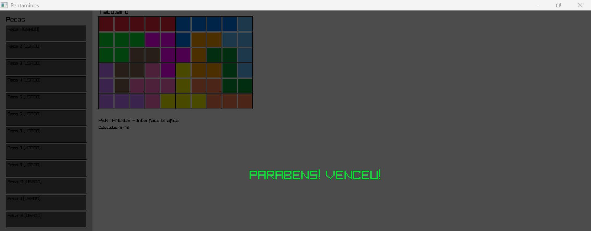

# Pentaminós

Aplicação para jogar e resolver o quebra-cabeça dos pentominós utilizando grafos, DFS, BFS e AVL.



—

## Como compilar (Windows)

- No PowerShell/Prompt, na pasta do projeto:
  ```bat
  .\compilar.bat
  ```
- Os binários são gerados em `build_gui`:
  - `pentaminos_play.exe` (GUI/Jogar e modos Resolver por linha de comando)
  - `pentaminos_demo.exe` (GUI com prefill padrão)

—

## Como executar

- Modo interativo (menu):

  ```bat
  .\build_gui\pentaminos_play.exe 6 10
  ```

  - O programa pedirá o modo: Jogar (GUI), Resolver DFS (uma/todas), BFS, ou Comparar DFS×BFS.
  - Tamanhos suportados: qualquer `m×n` com área múltipla de 5 até 60 (ex.: 6×10, 5×12, 4×15, 3×20). O número de peças usadas é `K = área/5`.

- Modos Resolver por flags (sem menu):

  ```bat
  .\build_gui\pentaminos_play.exe 6 10 --solve=dfs
  .\build_gui\pentaminos_play.exe 6 10 --solve=dfs --all
  .\build_gui\pentaminos_play.exe 6 10 --solve=bfs
  .\build_gui\pentaminos_play.exe 6 10 --compare
  ```

- Jogar (GUI):
  - Peças à esquerda; clique para selecionar.
  - Variações: ↑/↓ (ou W/S).
  - Colocar: clique no tabuleiro.
  - Desfazer: BACKSPACE; Sair: ESC.
  - Contador mostra “Colocadas: X/Y” onde `Y = K`.
  - Opcional: prefill automático (pergunta no menu). Ou use `--prefill`.

—

## Requisitos

- Windows 10+ com g++ (MinGW).
- Raylib (o script tenta automaticamente):
  - MSYS2 ucrt64 (recomendado):
    ```powershell
    pacman -S mingw-w64-ucrt-x86_64-raylib
    ```
  - vcpkg (alternativa MinGW dinâmica):
    ```powershell
    vcpkg install raylib:x64-mingw-dynamic
    ```

—

## Arquitetura

- `main.cpp`: GUI (Raylib), menu e orquestração.
- `src/piece`: geração de peças e variações (`Piece.cpp/.h`).
- `src/board`: tabuleiro e operações (`Board.cpp/.h`).
- `src/state`: estado de busca (`State.cpp/.h`).
- `src/avl`: árvore AVL para visitados (`AVLTree.cpp/.h`).
- `src/graph`: solvers (`GraphSolver.cpp/.h`).

—

## Algoritmos de Busca

### DFS (Busca em Profundidade)

A busca em profundidade foi implementada utilizando **backtracking recursivo**.

Funcionamento:

- Seleciona uma peça disponível
- Itera sobre todas as variações (rotações e reflexões)
- Tenta posicionar no tabuleiro
- Avança recursivamente para a próxima peça
- Em caso de falha, desfaz a jogada

Características:

- Encontra rapidamente uma solução válida
- Pode encontrar todas as soluções
- Uso eficiente de memória

---

### BFS (Busca em Largura)

Implementada com uma fila (queue), explorando o espaço de estados por níveis.

Funcionamento:

- Começa com o estado inicial (tabuleiro vazio)
- Expande estados possíveis nível por nível
- Cada estado representa uma configuração parcial

Características:

- Garante solução com menor profundidade
- Consome mais memória que DFS

---

## Estrutura AVL

Utilizada para armazenar estados visitados.

Objetivo:

- Evitar repetição de estados
- Melhorar desempenho

Funcionamento:

- Cada estado é convertido em uma chave (grid)
- Antes de explorar:
  - Se já existe → ignora
  - Senão → insere

Complexidade:

- Inserção: O(log n)
- Busca: O(log n)

—

## Complexidade

O problema possui crescimento exponencial.

- DFS:
  - Tempo: O(b^d)
  - Espaço: O(d)

- BFS:
  - Tempo: O(b^d)
  - Espaço: O(b^d)

—

## Notas

- A chave de estados na AVL utiliza o `grid`.
- “Todas as soluções” pode ser custoso; use com cautela.
